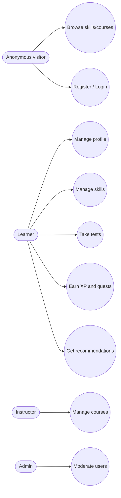
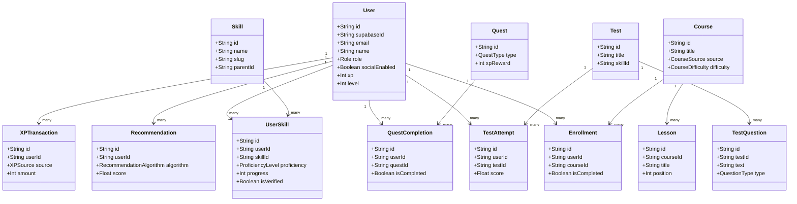

# SkillHub System Documentation

Bachelor's Final Degree Project Documentation (Technical and Academic Summary)

## Abstract

SkillHub is a web-based learning platform that combines structured skill tracking, course discovery, testing, and
gamified progression. The system is designed as a multi-service architecture: a Next.js frontend, an Express + Prisma
backend, and a local AI service for semantic recommendations. This document provides a comprehensive academic-level
overview of requirements, architecture, data model, and core workflows to support a Bachelor's final degree submission.
It is grounded in the current codebase and implementation constraints.

## Table of contents

1. Introduction  
2. Problem statement  
3. Objectives  
4. Scope and assumptions  
5. Stakeholders and personas  
6. Requirements  
7. System overview  
8. Architecture  
9. Backend design  
10. Frontend design  
11. AI service design  
12. Data model  
13. Use cases  
14. Class diagram  
15. Security, privacy, and ethics  
16. Performance and reliability  
17. Testing and validation  
18. Deployment and operations  
19. Limitations  
20. Future work  
21. Conclusion  

## 1. Introduction

Digital learning platforms often fragment learning into isolated courses without a unified model for skills,
progress, and outcomes. SkillHub targets this gap by centering the learning journey on skills and validated
competencies, supported by tests, recommendations, and gamified incentives. The project uses a modern web stack
and a service-oriented architecture to provide modularity, scalability, and a clean separation of concerns.

## 2. Problem statement

Learners face three persistent challenges:

- Discovering learning content aligned with their goals and current proficiency
- Measuring skill growth and validating progress through structured assessments
- Sustaining long-term engagement and motivation in self-directed learning

SkillHub addresses these challenges by creating a unified skills graph, tracking progress and verification attempts,
and augmenting content discovery with AI-driven recommendations.

## 3. Objectives

Primary objectives:

- Provide a skill-centric learning experience that tracks proficiency and progress over time
- Integrate a secure authentication flow using Supabase Auth while keeping backend ownership of user data
- Offer content discovery and testing functionality aligned with defined skills
- Add a gamification layer (XP, quests, streaks) that can be opted into by users
- Support AI-assisted recommendations while keeping the AI service isolated and optional

Secondary objectives:

- Enable admins and instructors to manage learning content and users
- Use a scalable architecture with caching and performance monitoring
- Maintain a clean, typed API boundary and input validation

## 4. Scope and assumptions

Scope (implemented):

- Web frontend with core routes: auth, register, dashboard, skills, courses, profile
- Express API serving all data for the frontend
- Supabase-backed authentication and user provisioning
- Prisma schema modeling users, skills, courses, tests, and gamification data
- AI service for skill/course recommendation using semantic similarity

Out of scope or partially implemented:

- Full instructor/admin consoles (planned in frontend docs)
- Advanced analytics dashboards
- Real-time collaboration features
- Comprehensive production observability stack (beyond in-app performance metrics)

Assumptions:

- Supabase is the identity provider; the frontend does not call Supabase directly
- API responses are wrapped to match the frontend HTTP client expectations
- Redis is available for caching and social features when configured

## 5. Stakeholders and personas

- Anonymous visitor: explores skills and courses, registers when ready
- Learner (USER): manages skill profile, enrolls in courses, takes tests, earns XP
- Instructor (INSTRUCTOR): creates and manages learning content and tests
- Administrator (ADMIN): moderates users, manages catalog, controls quests and reports

## 6. Requirements

### 6.1 Functional requirements

- User authentication with registration, login, refresh, and logout
- Profile management with optional social/gamification opt-in
- Skill management: browse skills, add to profile, update proficiency and progress
- Course management: list, view, enroll, bookmark, and import from external sources
- Testing: manage tests and attempts, store answers and scores
- Recommendations: suggest skills and courses based on profile and activity
- Gamification: XP, quests, streaks, and transaction history

### 6.2 Non-functional requirements

- Security: token-based auth, rate limiting on auth routes, input validation
- Reliability: graceful degradation if AI service is unavailable
- Performance: caching for read-heavy endpoints, request timing metrics
- Scalability: separated services and stateless API design
- Maintainability: typed interfaces and a clean repository structure
- Usability: responsive UI, clear navigation, i18n-ready routing

## 7. System overview

SkillHub is implemented as a three-service platform:

- Frontend: Next.js App Router application, acting as the presentation and interaction layer
- Backend: Express API handling auth, data access, and business logic via Prisma
- AI service: local FastAPI service providing semantic recommendations

All user-facing data flows through the backend; the frontend relies on a centralized HTTP client to maintain
consistent error handling, retries, and token management.

## 8. Architecture

### 8.1 Logical architecture

```mermaid
flowchart LR
    subgraph Client
        Browser[Next.js web client]
    end

    subgraph Backend
        API[Express API]
        Prisma[Prisma ORM]
        Redis[(Redis cache)]
    end

    subgraph Data
        Postgres[(Supabase Postgres)]
        SupaAuth[Supabase Auth]
        Storage[(S3/MinIO)]
    end

    subgraph AI
        AISvc[AI service (FastAPI)]
    end

    subgraph External
        YouTube[YouTube API/yt-dlp]
        Udemy[Udemy API]
    end

    Browser -->|HTTPS| API
    API --> Prisma
    Prisma --> Postgres
    API --> Redis
    API --> SupaAuth
    API --> Storage
    API --> AISvc
    API --> YouTube
    API --> Udemy
```

### 8.2 Deployment architecture

- Frontend deployed on Vercel
- Backend deployed in Docker (Hetzner Cloud in docs)
- AI service runs locally or alongside backend on its own port
- Database and Auth hosted by Supabase
- Redis configured for caching and social/gamification flows

### 8.3 Technology stack

| Layer | Key Technologies | Version (from repo) |
| --- | --- | --- |
| Frontend | Next.js, React, Tailwind CSS, TanStack Query, Zod | Next 16.0.3, React 19.2.0 |
| Backend | Express, Prisma, Supabase Auth, Redis | Express 5.1.0, Prisma 6.19.0 |
| AI | FastAPI, sentence-transformers, scikit-learn, numpy | sentence-transformers 3.3+ |
| Build | pnpm workspace, TypeScript | pnpm 10.22.0, TS 5.9.3 |

## 9. Backend design

### 9.1 Entry point and routing

The backend entry point is `backend/src/express.ts`. All routes are mounted under `/api` and organized into
modules (auth, users, skills, courses, tests, recommendations, social, and external integrations).

Highlights:

- `/api/auth/*` for registration, login, refresh, logout, and user profile
- `/api/skills`, `/api/courses`, `/api/tests`, `/api/recommendations`
- `/api/social` for gamification features
- `/api/chapters` and `/api/udemy` for external content ingestion

### 9.2 Authentication and authorization

The backend integrates with Supabase Auth and enforces token validation via middleware. Users are stored in the
local database and linked by `supabaseId`. Role-based access is supported for admin-only routes.

Key points:

- Auth endpoints are rate-limited
- Session tokens are validated against Supabase
- User profile creation is enforced after registration

### 9.3 Validation and error handling

Zod schemas validate request bodies, query parameters, and route params. A centralized error handler normalizes
responses, maps Prisma errors, and provides consistent error payloads.

### 9.4 Caching and performance

Redis is used for caching read-heavy endpoints. A response-time middleware tracks request latency and exposes a
performance endpoint for internal monitoring.

### 9.5 AI integration

The backend calls a local AI service (configurable via `LOCAL_AI_SERVICE_URL`). If the AI service is disabled
or unavailable, the backend falls back to rule-based recommendation logic.

## 10. Frontend design

### 10.1 App Router structure

The frontend uses Next.js App Router with locale-based routing under `src/app/[locale]/`. Implemented pages include:

- `/auth`, `/register` for authentication
- `/dashboard`, `/skills`, `/courses`, `/profile` for core application flows

### 10.2 Rendering strategy

Public and SEO-oriented pages are designed as Server Components, while authenticated and interactive flows are
Client Components. This balances performance with interactivity.

### 10.3 Data access and state

- Axios client with request/response interceptors, token injection, and retry behavior
- TanStack Query for caching and request deduplication
- React Hook Form + Zod for form handling and validation

### 10.4 UI layer

Reusable UI primitives live under `frontend/src/components/ui`, with higher-level features grouped by domain
(`dashboard`, `profile`, `social`).

## 11. AI service design

The AI service is implemented in `ai-service/app.py` and uses sentence-transformers to compute semantic similarity
between user prompts and available skills or courses.

Endpoints:

- `GET /health`: service status and model details
- `POST /recommend-skills`: skill recommendations
- `POST /recommend-courses`: course recommendations
- `POST /embed`: raw embeddings for future use

The service runs on port 5000 by default and is designed to be optional; the backend gracefully falls back if it
is unavailable.

## 12. Data model

The Prisma schema models the core entities:

- User, Skill, UserSkill, Course, Lesson, Enrollment
- Test, TestQuestion, TestChoice, TestAttempt
- Recommendation, Quest, QuestCompletion, XPTransaction

The model enables:

- Hierarchical skills with user-specific proficiency and progress
- Course linking to skills and lesson-level progress tracking
- Gamified progression via XP, quests, and streaks
- Verification attempts for skill proficiency

## 13. Use cases

### 13.1 Core use cases

| Actor | Use case | Description |
| --- | --- | --- |
| Anonymous | Browse skills/courses | Explore public catalog without login |
| Anonymous | Register | Create a new account |
| Learner | Login | Authenticate and access dashboard |
| Learner | Manage skills | Add or update skills and progress |
| Learner | Take tests | Attempt skill tests and receive scores |
| Learner | Earn XP | Complete quests and view XP history |
| Learner | Get recommendations | Receive AI-assisted suggestions |
| Instructor | Manage courses | Create or update course content |
| Admin | Moderate users | Soft delete or restore user accounts |

### 13.2 Use case diagram



## 14. Class diagram



## 15. Security, privacy, and ethics

- Authentication uses Supabase-managed credentials and tokens
- Backend enforces role-based guards and checks for protected routes
- Input validation mitigates common API abuse vectors
- Sensitive data is kept in environment variables and not in source control
- AI recommendations are advisory and do not replace user agency

## 16. Performance and reliability

- Caching for read-heavy endpoints via Redis
- Request timing metrics and health checks for monitoring
- AI service is optional with a fallback algorithm
- API responses are standardized to ensure consistent client behavior

## 17. Testing and validation

Testing guidance in the repository encourages:

- Unit tests near source files
- Frontend tests via React Testing Library
- Backend tests via Jest or Vitest with ts-node

In an academic setting, the test plan should include:

- Auth flow (register, login, refresh, logout)
- Skill CRUD and user skill progression
- Course listing, enrollment, and bookmarks
- Test attempts and scoring accuracy
- AI recommendation availability and fallback behavior

## 18. Deployment and operations

Development commands:

- `pnpm dev` (all services)
- `pnpm frontend:dev`
- `pnpm backend:dev`
- `pnpm ai:dev`

Production:

- `pnpm frontend:build` and `pnpm frontend:start`
- `pnpm backend:build` and `pnpm backend:start`

The backend expects environment variables for database, Supabase, Redis, and optional object storage
configuration. The frontend requires `NEXT_PUBLIC_BACKEND_URL`.

## 19. Limitations

- Some frontend routes are planned but not fully implemented
- AI service is local and not horizontally scaled
- Admin and instructor workflows are only partially present in the UI
- Monitoring is lightweight and not integrated with external observability platforms

## 20. Future work

- Expand instructor and admin dashboards
- Add advanced analytics and learning outcome reporting
- Introduce real-time collaboration and notifications
- Improve AI explainability and user control over recommendations
- Extend testing coverage with integration and end-to-end suites

## 21. Conclusion

SkillHub demonstrates a modern, scalable approach to skill-centric learning platforms by combining a structured data
model, a secure backend, a responsive frontend, and optional AI-driven personalization. The project aligns with
Bachelor's final degree expectations by showcasing requirements analysis, architectural design, implementation
discipline, and evaluation criteria that can be extended into a production-grade system.
